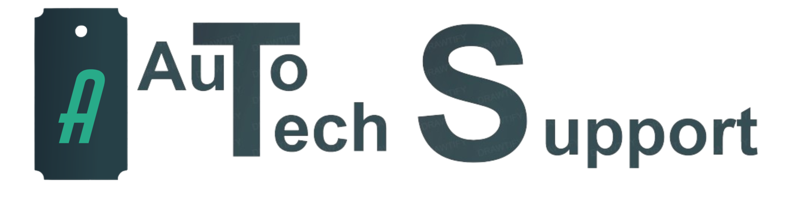

[![Contributors][contributors-shield]][contributors-url]
[![Forks][forks-shield]][forks-url]
[![Stargazers][stars-shield]][stars-url]
[![Issues][issues-shield]][issues-url]
<!--[![MIT License][license-shield]][license-url]
[![LinkedIn][linkedin-shield]][linkedin-url] -->

<!-- PROJECT LOGO -->
 

  

<h3 align="center">TicketManagement</h3>

  

    A full-stack web application used by registered users to manage support tickets, and to see logs from running services.
     
    <a href="https://github.com/KelyanDev/TicketManagement"><strong>Explore the docs »</strong></a>
     
     
  

<!-- TABLE OF CONTENTS -->

  
Table of Contents

  <ol>
    <li>
      <a href="#about-the-project">About The Project</a>
      <ul>
        <li><a href="#built-with">Built With</a></li>
      </ul>
    </li>
    <li>
      <a href="#getting-started">Getting Started</a>
      <ul>
        <li><a href="#prerequisites">Prerequisites</a></li>
        <li><a href="#installation">Installation</a></li>
      </ul>
    </li>
    <li><a href="#usage">Usage</a></li>
    <li><a href="#roadmap">Roadmap</a></li>
    <!--<li><a href="#contributing">Contributing</a></li>
    <li><a href="#license">License</a></li>-->
    <li><a href="#contact">Contact</a></li>
    <li><a href="#acknowledgments">Acknowledgments</a></li>
  </ol>

<!-- ABOUT THE PROJECT -->
## About The Project

   
Frontend fully done in React, while Backend is using NodeJS and Express.   
All the data are stored in a MongoDB database hosted locally on a Debian server.   
All the logs files of our services are stored locally on the Debian Server, and are accessed by our Backend app.

TicketManagement is a web application designed as a practical tool to help users create support tickets to ask help to administrators. It provides a user-friendly platform for anyone looking for help with a feature / bug, in a company.   

With a clean interface, the app is made to help users get the help they need, and making it simpler for them to manage their tickets.    

    
This project was developed as part of my studies; Its main goal was to discover how a full-stack ticket management application might work, with all of it's functionalities. The app also has a log section, to check the latest logs of a local running app.

(<a href="#readme-top">back to top</a>)

### Built With

* [![NodeJS][NodeJS.com]][Node-url]
* [![React][React.com]][React-url]
* [![ReactRouter][ReactRouter.com]][ReactRoute-url]
* [![Javascript][Javascript.com]][JS-url]
* [![Express][Express.com]][Express-url]
* [![MongoDB][MongoDB.com]][MongoDB-url]
* [![CSS][CSS.com]][CSS-url]

(<a href="#readme-top">back to top</a>)

<!-- GETTING STARTED -->
## Getting Started

Follow these steps to get your app up and running:

### Prerequisites

Before installing the app, you first need these techs (for latest versions, part of the code might need an update)
Also, make sure that you have NodeJS on your system, aswell as npm (for packages / starting) and git (to clone the repo)   

>[!NOTE]
>React Version: 18.0.0  
>React DOM Version: 18.0.0   
>NodeJS Version: 22.3.0  

### Installation

Clone the github repository:
- In a terminal, run `git clone https://github.com/KelyanDev/TicketManagement`

Install depedencies (frontend and backend folders):
- In a terminal, go into one of the folders (either frontend or backend)   
- Install all the dependencies with the command `npm install`   

Launch the app:
- Once you installed the dependencies, you'll need to start the frontend AND backend of the app
- To start a part of the app, go into the corresponding folder, and run `npm start`

>[!WARNING]
>The Database part will obviously not work, as you'll need a MongoDB database for that (either hosted locally or on Atlas).    
>You'll need to setup MongoDB on your own if you want the app to fully work   
>Same for the logs, you most likely won't have the services on your computer

(<a href="#readme-top">back to top</a>)

<!-- USAGE EXAMPLES -->
## Usage

Once both the frontend and the backend of the app are up and running, you can simply go on a web browser and go at the following adress: http://localhost:5000   

Once you launched the app, and assuming you have the database part working, you'll need to create an account using the top right button.    
Once your account is created, you can open a new ticket and check your existing ones.   

You won't be able to access the services logs, as you probably won't have the services running on your computer.   

(<a href="#readme-top">back to top</a>)

<!-- ROADMAP -->
## Roadmap

As I said earlier, this project was part of my studies. As I previously finished this, I do not intend to add functionalities to it (atleast not now)

See the [open issues](https://github.com/KelyanDev/FluxBiz/issues) for a full list of proposed features (and known issues).

(<a href="#readme-top">back to top</a>)

<!-- CONTACT -->
## Contact

My Portfolio - [Click here](https://kelyandev.github.io/)

Project Link: [https://github.com/KelyanDev/FluxBiz](https://github.com/KelyanDev/TicketManagement)

(<a href="#readme-top">back to top</a>)

<!-- MARKDOWN LINKS & IMAGES -->
<!-- https://www.markdownguide.org/basic-syntax/#reference-style-links -->
[contributors-shield]: https://img.shields.io/github/contributors/KelyanDev/TicketManagement.svg?style=for-the-badge
[contributors-url]: https://github.com/KelyanDev/TicketManagement/graphs/contributors
[forks-shield]: https://img.shields.io/github/forks/KelyanDev/TicketManagement.svg?style=for-the-badge
[forks-url]: https://github.com/KelyanDev/TicketManagement/network/members
[stars-shield]: https://img.shields.io/github/stars/KelyanDev/TicketManagement.svg?style=for-the-badge
[stars-url]: https://github.com/KelyanDev/TicketManagement/stargazers
[issues-shield]: https://img.shields.io/github/issues/KelyanDev/TicketManagement.svg?style=for-the-badge
[issues-url]: https://github.com/KelyanDev/TicketManagement/issues
[license-shield]: https://img.shields.io/github/license/KelyanDev/TicketManagement.svg?style=for-the-badge

[NodeJS.com]: https://img.shields.io/badge/Node%20js-339933?style=for-the-badge&logo=nodedotjs&logoColor=white
[Node-url]: [https://www.w3schools.com/](https://www.w3schools.com/nodejs/default.asp/)
[React.com]: https://img.shields.io/badge/React-20232A?style=for-the-badge&logo=react&logoColor=61DAFB
[React-url]: [https://reactjs.org/](https://react.dev/learn)
[ReactRouter.com]: https://img.shields.io/badge/React_Router-CA4245?style=for-the-badge&logo=react-router&logoColor=white
[ReactRoute-url]: [https://reactjs.org/](https://reactrouter.com/en/main)
[Javascript.com]: https://img.shields.io/badge/JavaScript-323330?style=for-the-badge&logo=javascript&logoColor=F7DF1E
[JS-url]: [https://reactjs.org/](https://www.w3schools.com/js/default.asp)
[Express.com]: https://img.shields.io/badge/Express%20js-000000?style=for-the-badge&logo=express&logoColor=white
[Express-url]: [https://reactjs.org/](https://expressjs.com/)
[MongoDB.com]: https://img.shields.io/badge/MongoDB-4EA94B?style=for-the-badge&logo=mongodb&logoColor=white
[MongoDB-url]: [https://reactjs.org/](https://www.mongodb.com/fr-fr)
[CSS.com]: https://img.shields.io/badge/CSS3-1572B6?style=for-the-badge&logo=css3&logoColor=white
[CSS-url]: [https://reactjs.org/](https://www.w3schools.com/css/default.asp)
